# 2D Triangle Editor and Rasterization

#### Steps followed: (From the base cpp code given)
- Initialized a 4 total VBO's, 2 for storing vertex positions, color and other 2 for storing line points positions and there colors
- Updated the shader code to match my current structure.

### Task1.1: Triangle soup editor
#### Insertion mode - When key i is pressed
Images showing inserting triangles 

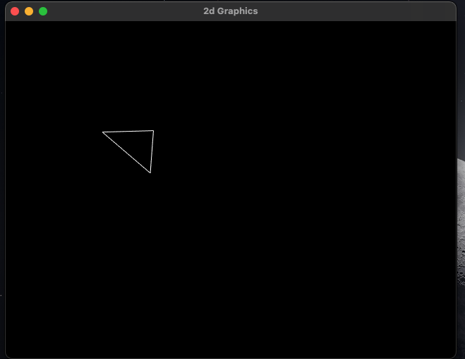
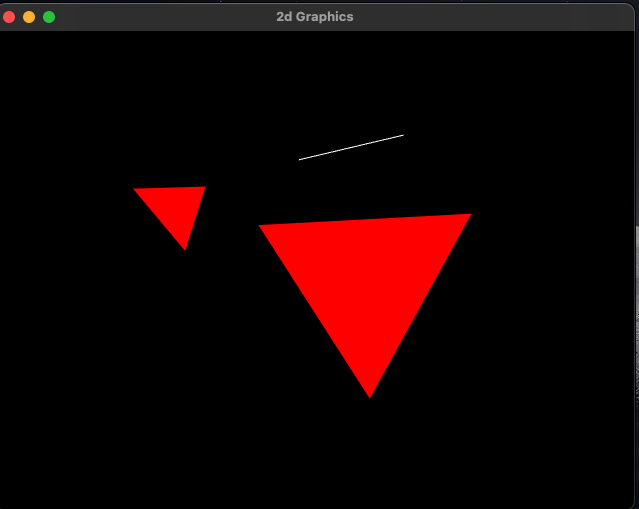
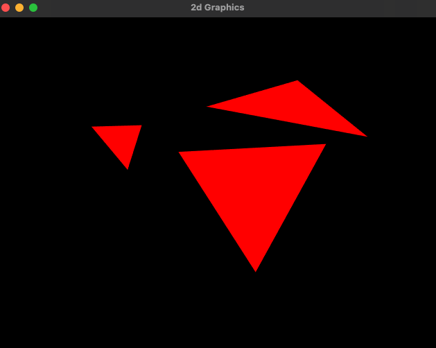
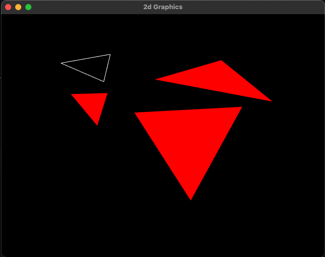

#### Translation mode - when key O is pressed
I have took screenshots after coloring vertices.

Image showing when a triangle is selected

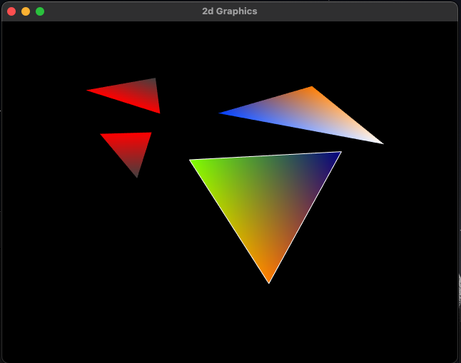

Image when the selected triangle is moved.

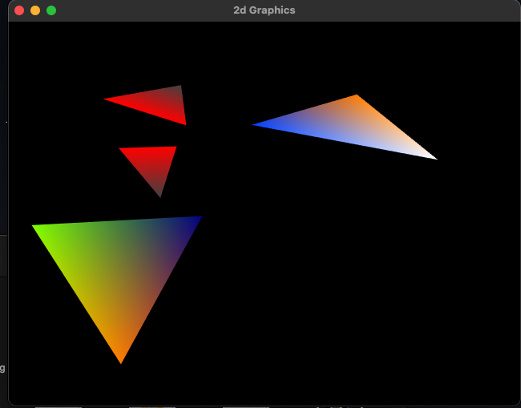

Image when the triangle beside the selected triangle is moved.
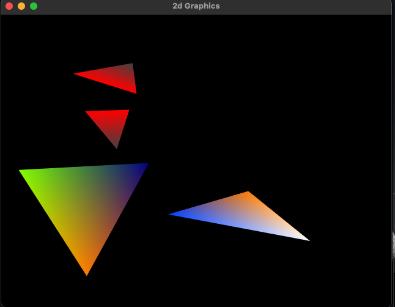

#### Deletion mode - when key p is pressed
Image when one of the small triangle inserted is deleted

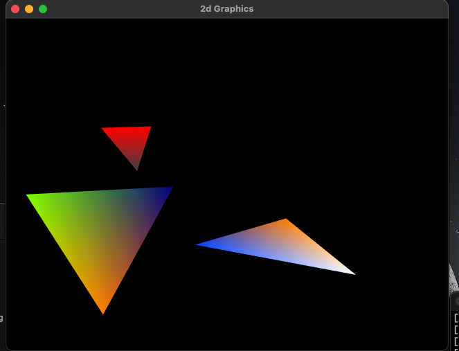

### Task1.2: Rotation and scale
Image when selected triangle is rotated clockwise.

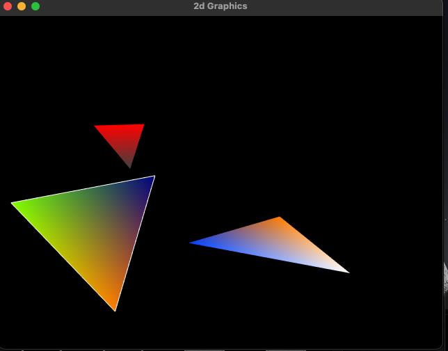

Image when selected triangle rotated counter clockwise.

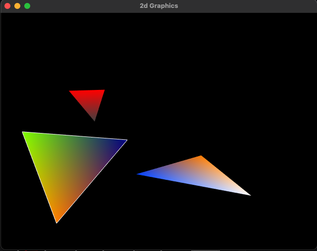

Image when selected triangle is scaled up.

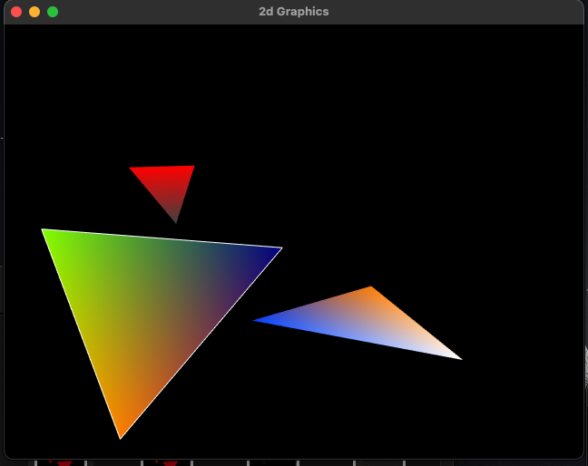

Image when selected triangle is scaled down.

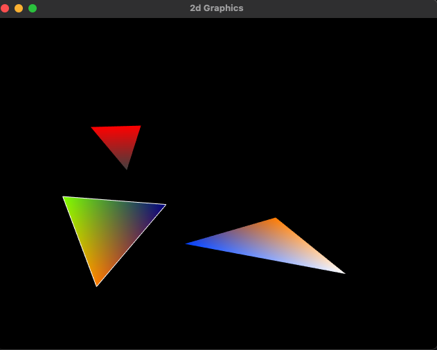

### Task1.3: Vertex Color
when a mouse click is done vertex near the click becomes dark greyish as shown in the vertices of small triangles
By clicking number from 1 to 9 different colors can be generated for vertices.

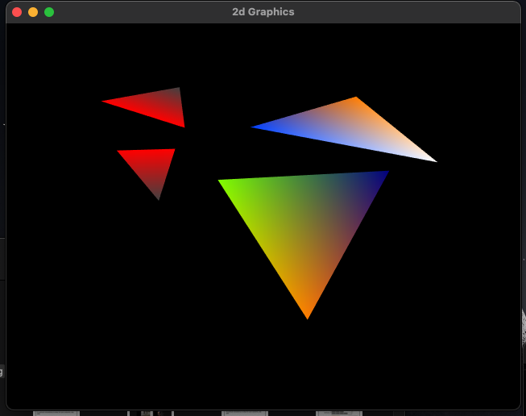

### Task1.4: View control
#### W, A, S, D keys
Moving the screen in all four directions.

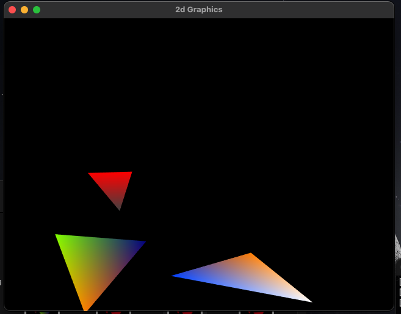
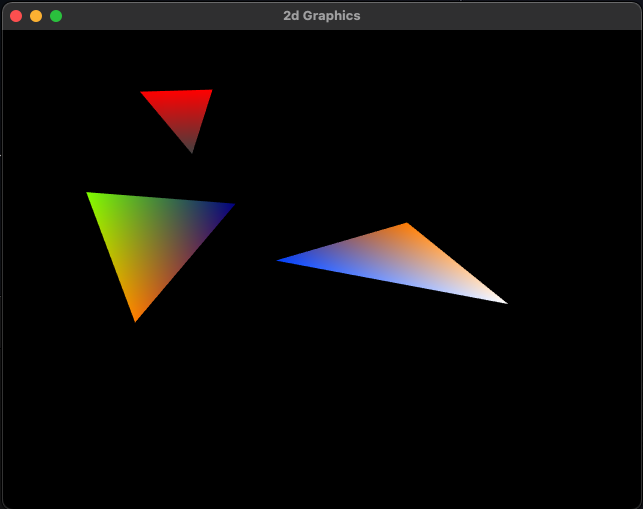
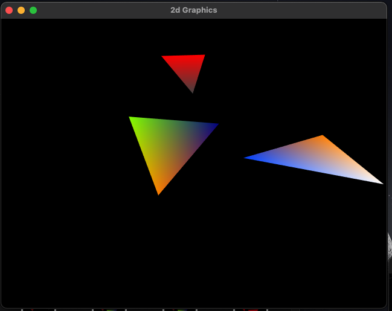
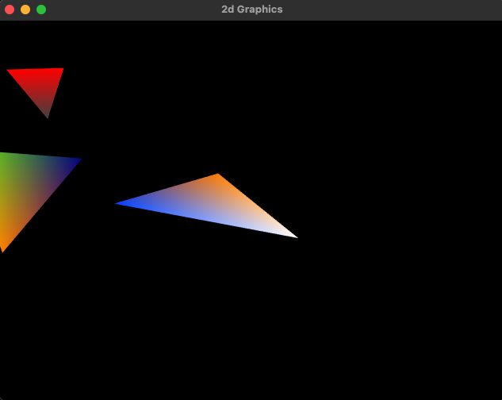

#### +, - keys
Image when view is zoomed in and zoomed out.

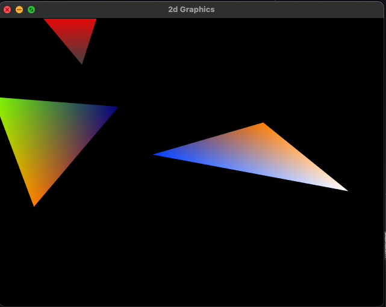
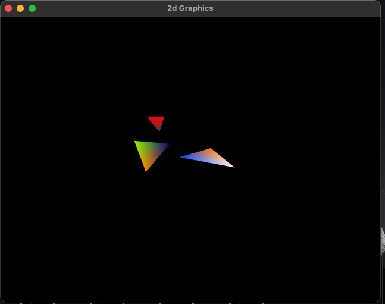

### Task1.5: Key Framing
- I only implemented key framing and animations only in translation.
- Here is the gif

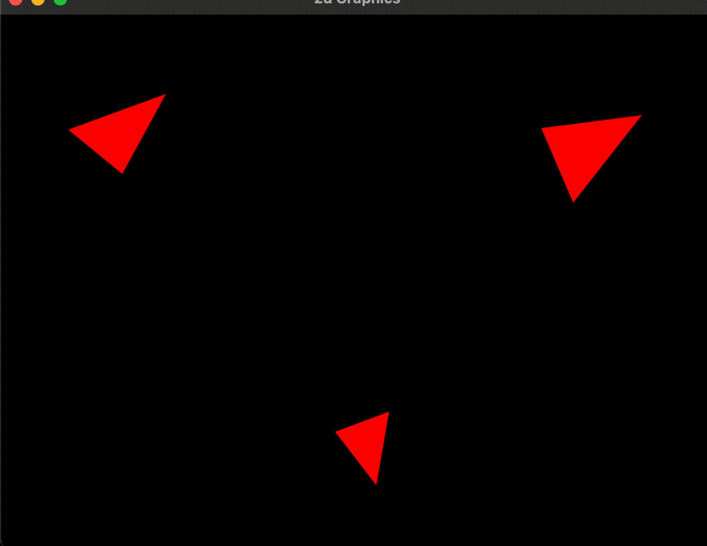

### Task2
#### Steps followed
- Implemented all the transformations  in vertex shader
- I am passing a transformation matrix, which takes care of rotation, scale of the triangle in the shader without changing the vertices
- View_matrix * Transformation_matrix * vec4(position, 0.0, 1.0). This generates the triangle after applying transformations
- View_matrix is what used in view control.

