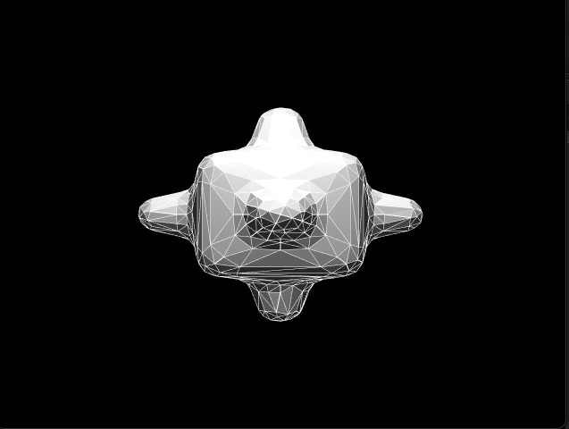
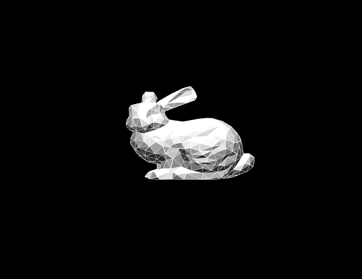
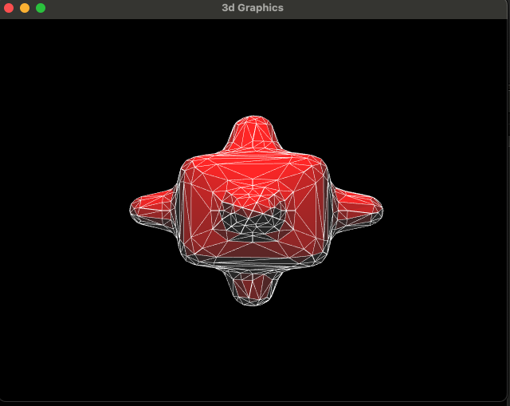
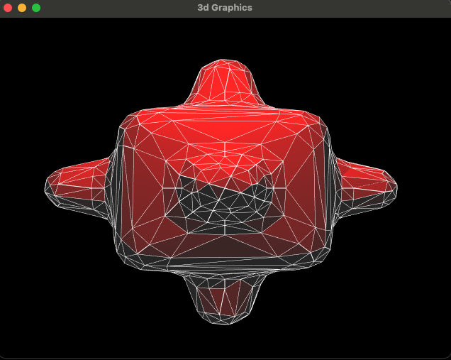
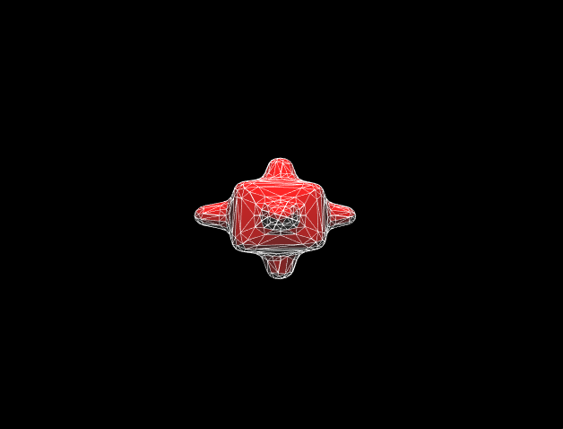
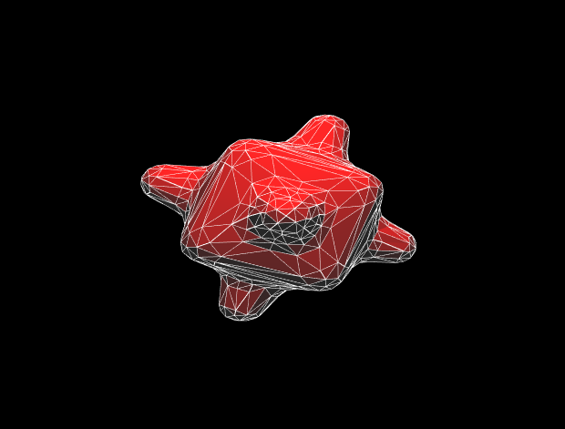
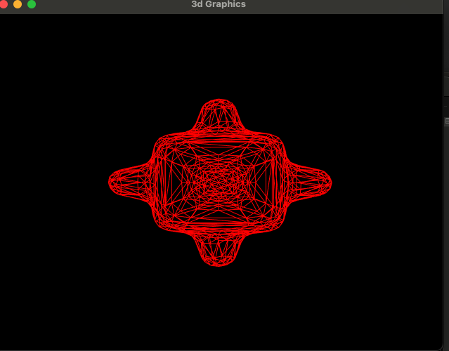
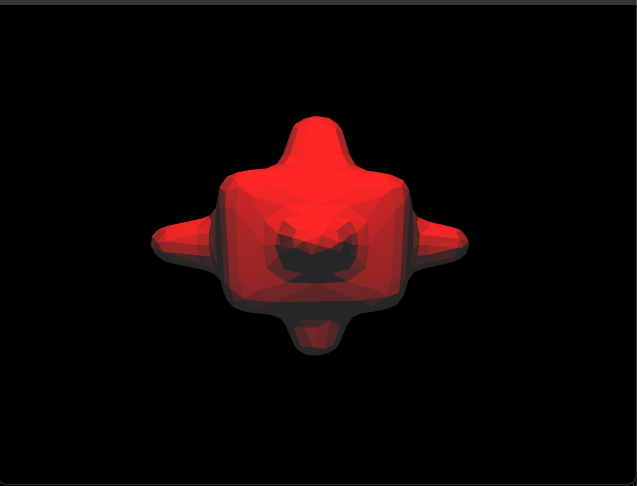
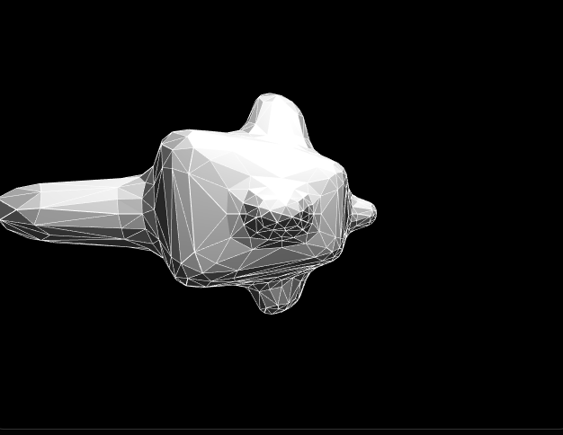

# 3D Scene Editor

### Scene Editor
Cube insert

Bumpy Cube insert

Bunny insert

### Object Control
Object selection

Scale

Rotate

Different Shading

### Camera Control

# References
 - *Fundamentals of Computer Graphics* 3rd edition by Marschner and Shirley
 - https://learnopengl.com/Getting-started/Transformations
 - https://developer.download.nvidia.com/CgTutorial/cg_tutorial_chapter05.html
 - Few resources from this respository are used for understanding methods: https://github.com/holistudio/interactive-computer-graphics
